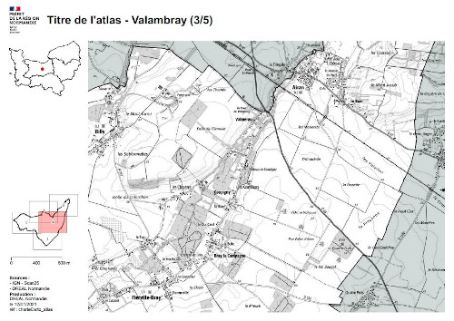

# Mise en page à la charte graphique gouvernementale

Ce répertoire contient l'ensemble des fichiers permettant de générer un atlas basé sur une couche de périmètres donnés et possédant la caractérisitique d'être composer que de cartes ayant la composition et la même échelle.

Vous pourrez trouver dans le répertoire `documentation/` le pas à pas et dans le dossier `fichiers` les différents scripts nécessaire à la génération d'un atlas

