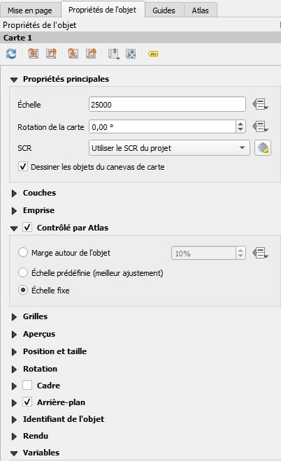

# Création d'un atlas à échelle constante et à format fixe

Ces quelques lignes ont comme objectif de fournir un pas à pas pour produire un atlas de carte ayant une échelle et une composition constantes. Il pourrait servir pour générer par exemple un atlas communal au format A4 avec des cartes au 1/25000e.

La contrainte principale lors de la génération d'un atlas est qu'un périmètre peut être plus grand que la fenêtre cartographique lorsque nous sommes contraint de respecter une échelle et un cadre. Il est alors nécessaire de produire pour celui-ci plusieurs planches puis de les assembler. Avec un nombre réduit de périmètres il est possible de gérer le découpage au cas par cas mais cela devient vite un casse tête pour un atlas communale avec plus de 2 500 collectivités comme c'est le cas en région Normandie.

Nous allons donc voir comment produire une couche de données géographiques permettant de générer l'emprise des planches et comment assembler ces planches en fonction du contexte de mise en page prédéfini.

## Préalable

L'utilisateur doit avoir accès en écriture à une base de données PostgreSQL possédant l'extension Postgis et disposer sur son poste du logiciel [QGIS](http://www.qgis.org). 

L'ensemble des développements ont été réalisés avec les versions logiciel suivantes :

* PostgreSQL : 9.4
* Postgis : 2.2
* QGIS : 3.10

La fusion des fichiers pdf nécessite l'installation de la bibliothèque python [PyPDF2](https://pypi.org/project/PyPDF2/)


## Etape 1 : fixer la mise en page des planches

La première étape de la génération de l'atlas est de définir la mise en page d'une planche afin de connaitre la dimension exacte de la fenêtre cartographique (hauteur et largeur)


Il est également nécessaire de fixer le recouvrement minimal entre les planches. 


**Hauteur, largeur, échelle et recouvrement** sont les 4 seules données nécessaires à la génération de la grille de l'atlas.

## Etape 2 : générer la grille des planches

La génération de la grille d'atlas s'effectue en lançant un script SQL dans postgresql. Il nécessite au préalable :

1. de fixer la mise en page (hauteur, largeur, recouvrement)
2. d'importer la couche geographique servant de base à la génération de la grille dans une base postgresql (ex : la couche des communes)

Le code sql avant d'être lancé doit être modifié pour prendre en compte les caractéristiques de votre projet. Tous ces changements s'effectuent dans les premières lignes du code.

``` sql
drop materialized view if exists mon_schema.ma_grille;
create materialized view mon_schema.ma_grille as
with 

    largeur_carte as (select 227 as l),--largeur de la fenêtre carte en mm
    hauteur_carte as (select 173.125 as h),--hauteur de la fenêtre carte en mm
    recouvrement_carte as (select 10 as r),--recouvrement minimal entre planche en mm
    echelle_carte as (select 25000 as e),--echelle de sortie des cartes
    
    
    /*on filtre les objets qu'on souhaite intégrer à l'atlas et on rajoute des informations*/
    perimetre_atlas as (
        select 
            insee_com as id_perimetre,
            st_xmax(geom) as xmax,
            st_xmin(geom) as xmin,
            st_ymax(geom) as ymax,
            st_ymin(geom) as ymin,
            geom 
        from "adminExpress".commune 
        where insee_reg='28'
    )
...
```

Ces modifications  concernent : 

* le **nom** de la vue matérialisée qui sera créée par le traitement : `mon_schema.ma_grille`
* la **largeur** en mm de la fenêtre cartographique dans `largeur_carte as (select 227 as l)`
* la **hauteur** en mm de la fenêtre cartographique dans `hauteur_carte as (select 173.125 as h)`
* la valeur en mm du **recouvrement** minimal entre chaque planche dans `recouvrement_carte as (select 10 as r)`
* la valeur de l'**échelle** de sortie dans `echelle_carte as (select 25000 as e)`
* la selection permettant de choisir **les objets à "découper"** en mettant en attribut `id_perimetre` l'indentifiant unique de la couche, en mettant le nom de la table ad hoc dans la clause `from` et le filtre adéquate dans la clause `where`

Une fois ces modifications effectuées, il suffit dans lancer le script sql. Une vue matérialisée est alors créée et réutilisable dans QGIS pour être utiliser dans la génération de l'atlas.

La couche géographique générée possède 3 attributs :

* gid : entier unique incrémenté à partir de 1/25000e
* id_perimetre : correspondant à l'identifiant unique de la couche source (pour un atlas communal se sera par exemple le numéro insee de la commune)
* num : numéro de planche de l'objet

## Etape 3 : produire l'atlas dans QGIS

### paramètre de base

En tout premier lieu, il convient d'intégrer dans le projet QGIS la couche géographique générée à l'étape précédente qu'on appellera par la suite `grille` et la couche source des périmètres qui ont servi à la génération de la grille que nous appellerons `perimetre`. 

Ensuite, il est nécessaire de définir *les paramètres de génération de l'atlas* dans la mise en page qui a servi à définir les données en entrée pour la génération de la grille (hauteur, largeur, échelle et recouvrement). 


Il s'agit :

* d'indiquer à QGIS la couche permettant de générer l'atlas (pour nous `grille`), 
* de définir un nom de page et de fichier d'export 
* d'indiquer que la sortie s'effectuera avec un fichier par périmètre d'atlas.

L'étape suivante, consiste à définir le comportement de la fenêtre cartographique en fonction de l'atlas. Cette opération s'effectue en sélectionnant l'objet carte de la mise en page et en se rendant dans les propriétés de l'objet.



Dans cet onglet il convient :

* de fixer l'échelle de sortie pour qu'elle corresponde à la donnée entrée lors de la génération de la grille (dans l'image ci-dessous 25000)
* d'indiquer que l'objet carte est contrôler par Atlas
* d'indiquer la méthode "Echelle fixe" pour la génération de l'atlas

### Bonus pour la mise en page

#### Un titre en fonction du périmètre

L'attribut `"id_perimetre"` de la `grille` permet de faire le lien avec la couche `perimetre` pour récupérer par exemple le libelé du périmètre.

Pour un atlas communal produit à partir de la couche commune d'AdminExpress, la formule suivante permet de récupérer le nom de la commune concernée par la planche :

```
attribute(
    get_feature(
        'perimetre',
        'insee_com',
        attribute(@atlas_feature,'id_perimetre')
    ),'nom_com'
)
```

#### Indiquer le nombre de planches créer pour un périmètre

Le but ici est de pouvoir indiquer le nombre de planches concernant un périmètre pour indiquer par exemple qu'il s'agit de la 1ere sur N planche comme par exemple  *"Vire Normandie (1/15)"*.

la formule ci-dessous permet de calculer pour le périmètre généré par l'atlas le nombre de planches conernant le périmètre :

```
 aggregate(
    layer:='grille', 
    aggregate:='max',
    expression:="num",
    filter:=
        "id_perimetre" = attribute(@atlas_feature,'id_perimetre')
)
```

#### Représenter les emprises des planches pour un périmètre

Il est possible de représenter l'emprise des planches concernant un périmètre pour faire une carte de localisation de la planche concernée comme l'illustre l'image ci-dessous.


Ceci s'effectue en définissant une règle de représentation pour ne représenter que les objets de la `grille` concernés par le `perimetre` avec la formule `"id_perimetre" = attribute(@atlas_feature,'id_perimetre')` et en représentant les géométrie de la `grille` par un rectangle défini dans le générateur de géométrie avec la formule suivante. 

```
with_variable( 
    'centre',
    make_point(
        (xmin($geometry)+xmax($geometry))/2,
        (ymin($geometry)+ymax($geometry))/2
    ),
    make_polygon(
        make_line(
            translate(
                @centre, 
                -227/2*25, 
                -173.125/2*25
            ),
            translate(
                @centre, 
                -227/2*25, 
                173.125/2*25
            ),
            translate(
                @centre, 
                227/2*25, 
                173.125/2*25
            ),
            translate(
                @centre, 
                227/2*25, 
                -173.125/2*25
            ),
            translate(
                @centre, 
                -227/2*25, 
                -173.125/2*25
            )
        )
    )
)
```

Le rectangle englobant est dépendant de la hauteur et de la largeur de la mise en page ainsi que de l'échelle. L'exemple ci-dessous correspond à une fenêtre carte de largeur `227 mm`, de hauteur `173,125 mm` et d'échelle `1/25000e`.

## Etape 4 : assembler les planches relatives à un même périmètre

La génération des pdf depuis QGIS va générer plusieurs planches pour les périmètres n'entrant pas complètement dans une page d'atlas. N fichiers pdf nommés `Identifiant_n.pdf` avec n compris entre 1 et N seront produits. Le but de cette étape est de **fusionner les planches pour ne créer qu'un seul pdf par périmètre**.

Cette opération s'effectue au moyen d'un script **python** lancé dans qgis utilisant la bibliotèque PyPDF2.

``` python
from PyPDF2 import PdfFileMerger, PdfFileReader
import os, glob

# à modifier en fonction du projet
dossier = r'd:\users\jerome.potel\Documents\CharteCarto\exemple_atlas\input' 
themeCarte = 'ZNS'
nbIdentifiantPerim = 5

# création d'un dossier de sortie nommé output
os.makedirs(dossier+r'\output', exist_ok=True)

# génération d'une liste contenant les noms des fichiers pdf
listPerim = []
listFichier = glob.glob(dossier+r"\*.pdf")
for item in listFichier :
    listPerim.append(os.path.basename(item)[0:nbIdentifiantPerim])
listPerim = list(set(listPerim))

# écriture des fichiers pdf fusionné
os.chdir(input)
for item in listPerim :
    merger = PdfFileMerger()
    files = [x for x in os.listdir(input) if x.startswith(item) and x.endswith('.pdf')]
    for fname in sorted(files):
        with open(os.path.join(input, fname), 'rb') as f:
            merger.append(PdfFileReader(f))
    print(item)
    merger.write(dossier+r'\output\\'+item+themeCarte+'.pdf')
```

En fonction du projet, 3 paramètres doivent être modifiés dans le script :

1. `dossier` : chemin du dossier où se trouve les pdf générés par la génération de l'atlas dans QGIS
2. `themeCarte` : chaine de caractère ajouté après l'identifiant du périmètre lors de la génération du pdf par le script python
3. `nbIdentifiantPerim` : longueur de l'identifiant du périmètre (ex : pour un epci 9, pour une commune 5...)

Le script créera un dossier output dans le dossier ou se situe les pdf sources.


